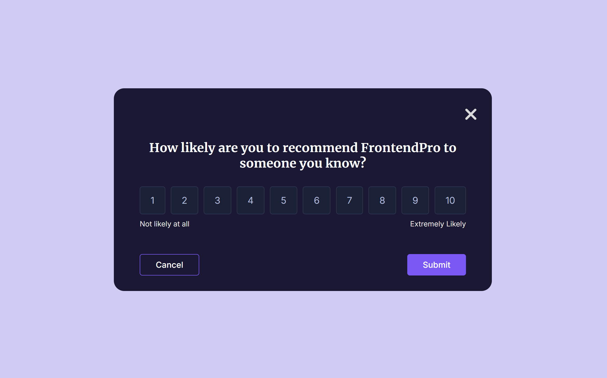

<h1>Feedback Modal Component</h1>

<h1>Challenge Requirements</h1>
The Feedback Modal Component should be triggered by a button, and it should appear as a modal overlay on top of the current page. The modal should include a rating scale that allows users to rate a product on a scale of 1 to 10. Users should be able to select a rating by clicking on a number in the scale. The modal should close when the user submits their feedback. The modal should get closed by clicking on a “Cancel” button or by clicking outside of the modal. Show the hover state of all the elements. The component should be responsive and display correctly on different screen sizes.

<h1>About the Challenge</h1>
In this frontend challenge, you'll build a Feedback Modal Component. This challenge is perfect for you if you've been learning CSS and HTML and are looking to practice what you've learned by building something new and beginner-friendly.

<h1>Taking Your Project to the Next Level</h1>
Consider enhancing your project with advanced CSS techniques or by exploring CSS frameworks like Bootstrap or Bulma. Additionally, you can experiment with basic JavaScript to add interactivity to your modal component.

<h1>Installation Steps</h1>
1. Clone the repository.
2. Open index.html in your web browser to view the menu.

<h1>Tech Stack</h1>
- HTML
- CSS

<h1>Prerequisites</h1>
Before installation, please make sure you have already installed the following tools:

- Web browser (e.g., Chrome, Firefox, Edge)

<h1>Preview</h1>

<h1>Project Structure</h1>
The project structure is organized as follows:

- index.html
- styles.css

<h1>Contributing</h1>
Contributions are what make the open-source community such an amazing place to learn, inspire, and create. Any contributions you make are greatly appreciated.

- Fork the Project
- Create your Feature Branch (git checkout -b feature/AmazingFeature)
- Commit your Changes (git commit -m 'Add some AmazingFeature')
- Push to the Branch (git push origin feature/AmazingFeature)
- Open a Pull Request

<h1>Resources</h1>
[An Interactive Guide to Flexbox](https://www.joshwcomeau.com/css/interactive-guide-to-flexbox/)
